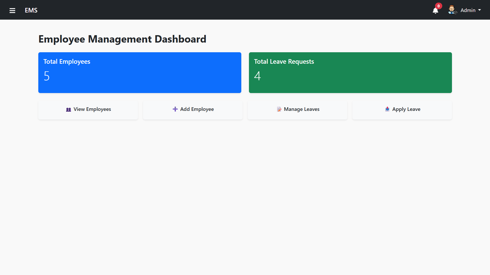
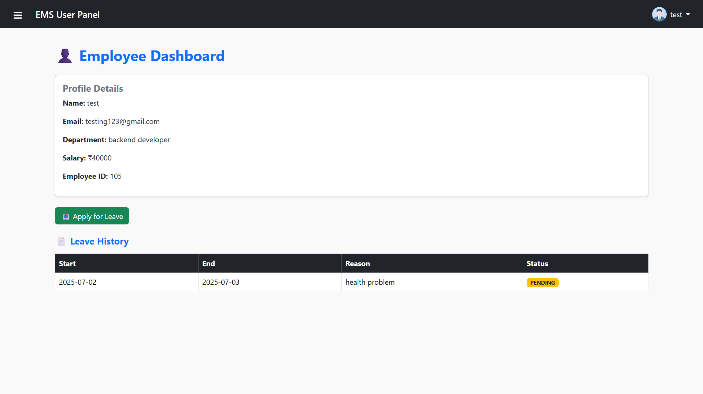
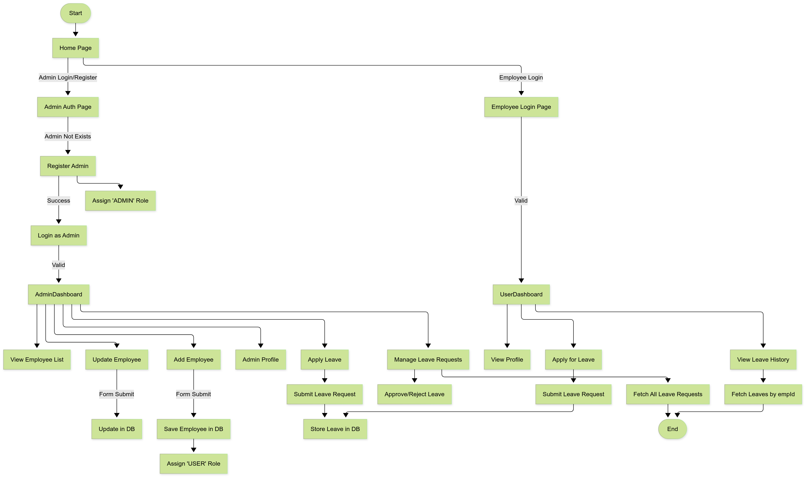
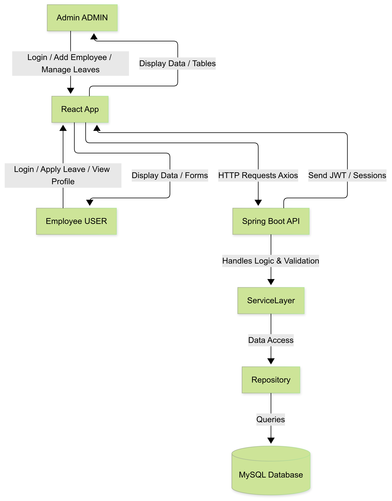

# 🧑‍💼 Employee Management System (EMS)

A full-stack **Employee Management System** built using **Spring Boot (Java)** for the backend and **ReactJS** for the frontend. It supports **role-based authentication (Admin & User)**, employee management features, leave requests, real-time email notifications, and a modern UI.

---

## 🚀 Features

### 👤 Admin
- Login and register (only one admin can exist)
- Add, update, delete employees
- View employee list
- Manage leave requests (approve/reject)
- Auto-email password on employee creation

### 🙋‍♂️ Employee (User)
- Login and view profile
- Apply for leave
- View leave history

---

## 🛠️ Tech Stack

### Backend
- Java, Spring Boot
- Spring Security + JWT
- JPA + Hibernate + MySQL
- JavaMailSender for sending emails

### Frontend
- ReactJS + Axios + Bootstrap 5
- Role-based route protection
- Responsive layout with sidebar + navbar
- Reusable components for Admin and User panels

---

## 📸 Screenshots

| Admin Panel | User Panel |
|-------------|------------|
|  |  |

|  FlowChart  |SystemDesign|
|-------------|------------|
|  |  |

---

## 🌐 Live Demo

🔗 [Live Site](https://ry-ems.vercel.app/)

---